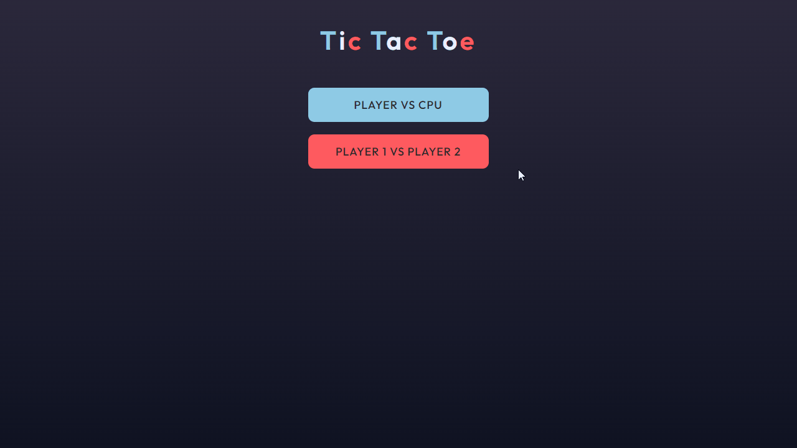
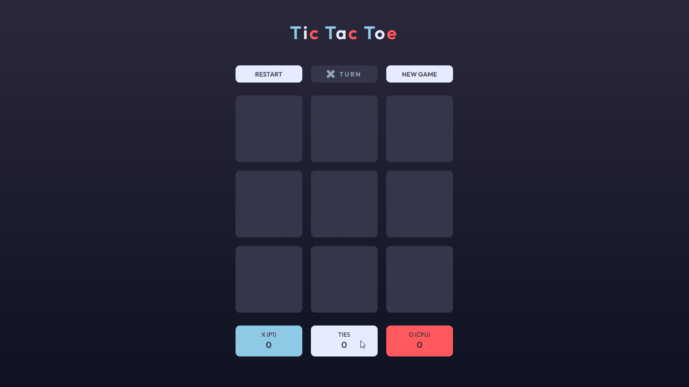
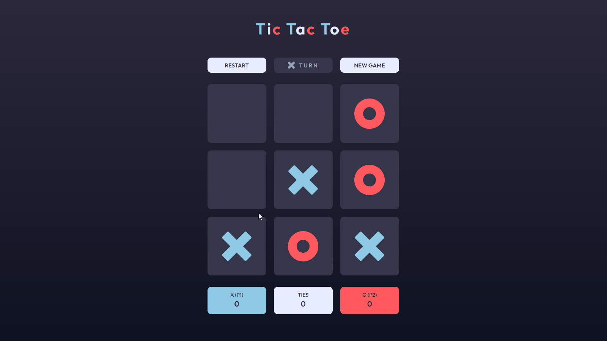

# Tic Tac Toe

This project is a Tic Tac Toe game created using HTML, CSS/SAAS, and JavaScript.

## 🔗 Link

- [Live Site URL](https://julianachagas.github.io/tic-tac-toe/)

## 🛠️ Technologies

- HTML
- CSS
- SASS
- JavaScript

## 💡 Features

- Users are able to play the game either solo vs the computer or multiplayer against another player
- Users are able to enter their names
- Game state is saved in the browser so that it’s preserved if the player refreshes their browser
- Users are able to restart the current round and reset the game board
- Users are able to go back to the initial screen and start a new game
- 2 players: the first turn of the first round is always played by whoever is playing as X. For every following round, the first turn alternates between O and X
- The scoreboard shows wins and ties
- At the end of a round, a modal is displayed with the game result
- After a round, the player can start a new round or quit. If the player chooses to quit the game, they are taken back to the initial screen.

## 💻 Demo

- Initial screen: user can choose the game type: player vs CPU or player 1 vs player 2, and enter players' names

  

- Game Screen: gameboard, scoreboard, Restart and New Game buttons

  

- Result Modal

  

## 👩🏻‍💻 Author

---

##### Made with 💜 by Juliana Chagas
